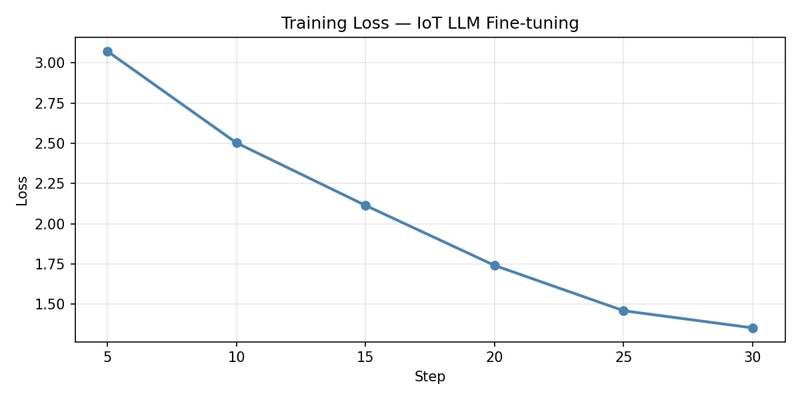

# IoT Sensor Interpretation via LLM Fine-Tuning

Fine-tuning a TinyLLaMA model to interpret IoT sensor data and generate human-readable
decisions — demonstrating how LLMs can act as a **reasoning layer** on top of traditional
ML/RL systems in Agentic AI architectures.

> **Why this matters:** RL and ML systems output numeric actions. They can't explain *why*.
> This project shows how a fine-tuned LLM bridges that gap — turning raw sensor readings
> into interpretable decisions and recommendations.

---

## Results

| Metric | Value |
|---|---|
| Model | TinyLlama-1.1B-Chat-v1.0 + LoRA (r=8, alpha=16) |
| Training steps | 30 (3 epochs) |
| Final training loss | 1.3527 |
| Starting loss | 3.0731 |
| Loss reduction | 56.0% |

**Training loss curve:**



**Before vs. after fine-tuning:**

| | Input | Output |
|---|---|---|
| **Base model** | `Node 1: CPU 90%, RAM 80%, Temp 82C, Latency 220ms` | `CPU cooling  Node 3: CPU 90%, RAM 80%, Temp 82` ← incoherent, repeats input |
| **Fine-tuned** | `Node 1: CPU 90%, RAM 80%, Temp 82C, Latency 220ms` | `Increase CPU utilization by 10% => Increase RAM usage by 10% => Decrease temp by 2C` ← structured action plan |

The base model hallucinates and echoes the input. The fine-tuned model produces a structured,
actionable response — demonstrating that domain adaptation via LoRA works even with a small dataset.

---

## Motivation

Traditional ML and RL systems are powerful but opaque:
- They operate on numeric vectors and output numeric actions
- They cannot explain their decisions in natural language
- They offer no high-level reasoning or recommendations

LLMs complement these systems by:
- Translating low-level sensor readings into semantic understanding
- Providing human-readable explanations and recommendations
- Acting as a reasoning or planning component in Agentic AI pipelines

This is particularly relevant in **edge computing and 5G/6G network management**,
where automated systems must make real-time resource allocation decisions that
operators can understand and audit.

---

## Architecture

```
Raw IoT Sensor Data
  CPU: 95%  RAM: 85%  Temp: 85C  Latency: 300ms
           │
           ▼
  Textual Representation
  "Node 1: CPU 95%, RAM 85%, Temp 85C, Latency 300ms"
           │
           ▼
  Tokenizer  →  Token IDs  →  [1012, 3489, 12, 492, 95 ...]
           │
           ▼
  Fine-tuned TinyLLaMA
           │
           ▼
  "High load detected at Node 1. Shift workload to Node 2."
```

---

## Dataset Format

Each training example is an input/output pair mapping sensor readings to decisions:

```json
{
  "input": "Node 1: CPU 95%, RAM 85%, Temp 85C, Latency 300ms",
  "output": "High load detected at Node 1. Shift workload to Node 2."
}
```

The dataset (`iot_dataset.json`) contains examples covering:
- High load / overload scenarios
- Normal operation
- Thermal warnings
- Network latency issues
- Multi-node workload balancing

---

## How Fine-Tuning Works

The model is trained using **LoRA (Low-Rank Adaptation)** — an efficient fine-tuning
technique that freezes the base model weights and trains only small adapter matrices,
reducing memory and compute requirements dramatically.

```
LoRA config:
  rank (r)       = 8
  alpha          = 16
  target modules = q_proj, v_proj   ← attention layers only
  dropout        = 0.05

Training config:
  epochs         = 3
  batch size     = 1
  learning rate  = 3e-4
  precision      = fp16
```

Key steps:
1. Load pretrained TinyLlama-1.1B-Chat + tokenizer
2. Attach LoRA adapters to attention projection layers
3. Format dataset: `"Sensor readings: {input} => Action: {output}"`
4. Tokenize + set labels = input_ids (causal LM objective)
5. Train with HuggingFace `Trainer`
6. Save adapter weights to `llama_iot_demo/checkpoint-30/`

---

## Setup

```bash
pip install transformers datasets torch
```

Run the notebook: `fine_tuning.ipynb`

Requires a GPU (tested on Google Colab T4 — free tier). Training completes in ~5 minutes.

---

## Connection to Agentic AI

This project is a building block for a larger agentic architecture:

```
Sensor Layer  →  LLM Reasoning Layer  →  Action Execution Layer
(raw data)       (this project)          (API calls, RL policy)
```

The fine-tuned model can serve as the **natural language reasoning component**
in an agentic loop — receiving observations, generating decisions, and handing
off to execution systems. See also:
- [Billing-Agentic-AI](https://github.com/JeffreyRed/Billing-Agentic-AI-customer-support) — agentic tool-calling loop
- [LLMOps](https://github.com/JeffreyRed/LLMOps) — embeddings and retrieval pipeline

---

## Next Steps

- Scale dataset to 300–500 examples using telecom/5G domain knowledge
- Upgrade to Llama 3.1 8B with QLoRA for higher quality outputs
- Add RAG layer to ground decisions in network documentation
- Evaluate with ROUGE score and domain-expert review
- Deploy adapter weights to Hugging Face Hub

---

## Author

[Jeffrey Redondo](https://jeffreyredondo.vercel.app) — PhD in Computer Science (AI & Networking),
Senior Researcher at Iquadrat Barcelona. Background in 5G/6G network optimization,
multi-agent RL, and edge computing.